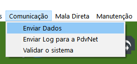
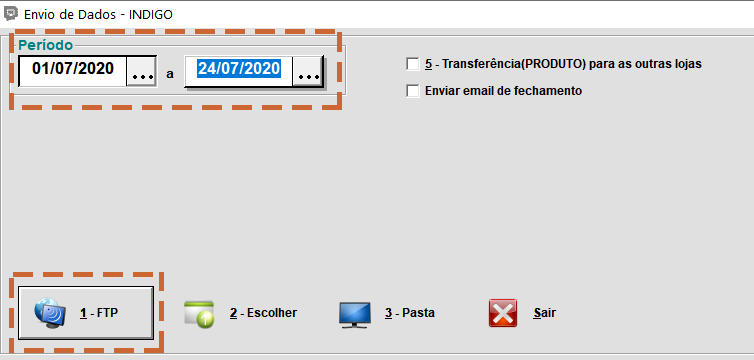
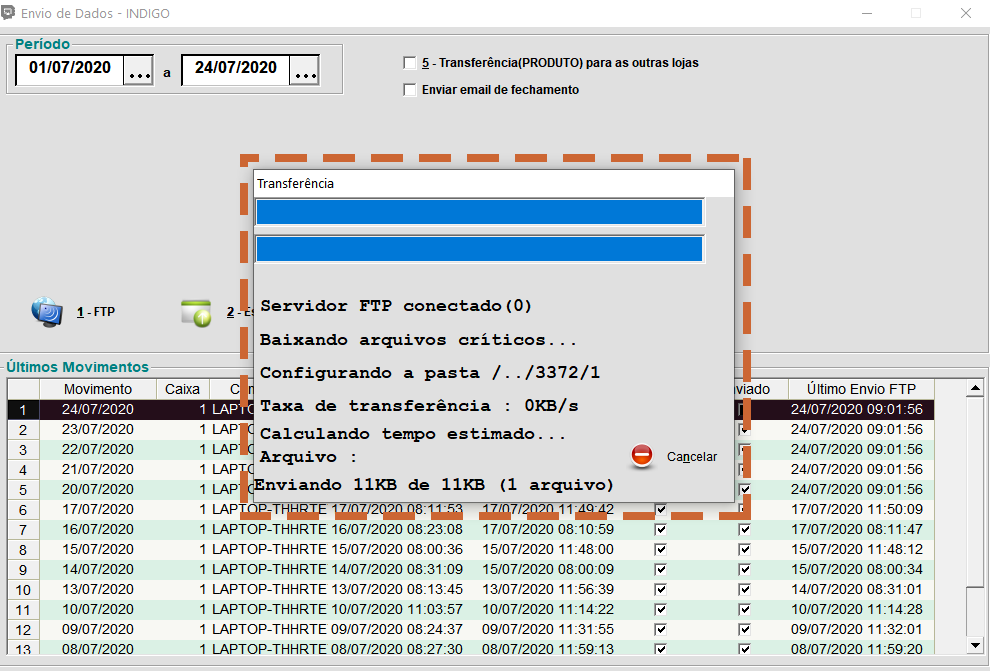

Toda vez que um caixa é fechado no fim do dia, automaticamente o sistema faz a sincronização de dados finais daquele dia. Este processo de sincronização acontece por várias vezes durante um dia, enquanto estamos trabalhando. Ou seja, sem que você faça algo, o seu sistema vai enviando informações para a matriz.

Contudo, pode acontecer de que nem todos os dados sejam enviados. O resultado disso, é que você pode executar uma venda (errada por exemplo), e aí seu supervisor em outro lugar não está enxergando esta venda no sistema dele.

O que é necessário fazer? O vendedor precisará enviar dados.

Vamos ao passo-a-passo:

1.Acesse o Módulo PDVAdmin:

  

2.Clique em "Comunicação", em seguida, "Enviar Dados":

 

3.Defina qual o "Período" e depois em "FTP":

  

4.A transferência irá iniciar, e basta aguardar o termino:

 
