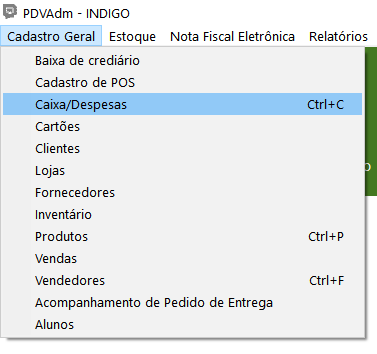
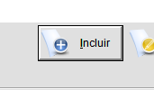
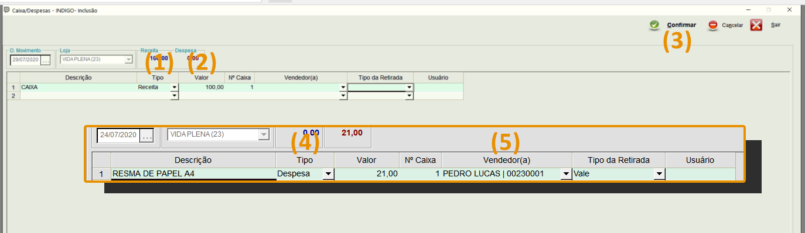

É regra de trabalho fazer o lançamento diário parte de Caixa / Despesa.

**O que significa dizer que é obrigatório.**

Mas como funciona e para que serve?

Quando você começa seu dia de trabalho, certamente você tem um dinheiro em caixa. Isso significa que você deve lançar este valor. Assim como quando você termina seu dia de trabalho, obrigatoriamente você deve encerrar o movimento.

Toda vez que acontecer uma nova entrada que não seja por venda (tipo fundo de caixa, por exemplo), você deverá lançar.

**Toda abertura de movimento (início do caixa), você deve lançar exatamente como tem.**

É importante também, entender que além disso, todas as saídas devem ser lançadas, para que não haja diferença no seu caixa.

Vamos a um exemplo prático:

*Na segunda-feira você vai começar seu primeiro dia de atendimento. Consequentemente você ainda não fez nenhuma venda. É padrão da Índigo, que você tenha em caixa sempre o mínimo de R$ 100,00 para dar troco aos clientes. Chamamos isso de fundo de caixa. O que você deve fazer assim que abrir o sistema? Lançar estes R$ 100,00 que estão em seu caixa.*

*Durante o dia, você fez diversas vendas. Em dinheiro entraram R$ 3.100,00. O dia terminou, ninguém passou para recolher dinheiro e você fechou o seu caixa. No dia seguinte (terça-feira) você está novamente iniciando seu caixa (tal como fez no dia anterior). O que você deve fazer assim que abrir o sistema? Lançar o seu valor de caixa. A grande questão é: quanto você deve lançar?*

*Bem, se você tinha R$ 100,00 e entraram R$ 3.100,00, seu total em caixa é de R$ 3.200,00. Este é o valor que deve ser lançado, pois é exatamente a quantia que tu tens em mãos.*

*Suponha-se que nesta terça-feira entraram mais R$ 2.000,00, só que no fim do dia, o seu supervisor chega para fazer a sangria (processo de conferência e retirada de dinheiro). Qual seu procedimento no sistema? Você deve ir lá em caixa / despesa e lançar esta saída que está acontecendo. Mas quanto você deve lançar de saída? Vamos ao cálculo:*

*R$ 100,00 (Fundo) + R$ 3.100,00 (vendas na segunda-feira) + R$ 2.000,00 (vendas na terça-feira). Isso nos dá um total de R$ 5.200,00.*

*Contudo não podemos esquecer que R$ 100,00 são para o fundo de caixa. Logo, o seu supervisor só deverá fazer a sangria dos valores referentes a venda, ou seja, R$ 5.100,00. Este deverá ser o valor que você lançará como Despesa, pois é algo que está saindo.*

Tudo que entra é receita, tudo que sai é despesa. Neste exemplo que citamos, a despesa está sendo a sangria que está sendo feita. Estão saindo R$ 5.100,00.

Toda saída tem que ser lançada, se não vai ficar contando valor a mais em seu caixa, o que pode ocasionar divergência e possíveis problemas.

Para lançar o seu caixa/despesa, siga o passo-a-passo:

1.Acesse o Módulo PDVAdmin:

  

2.Clique em "Cadastro Geral", em seguida, "Caixa/Despesa":

  

3.Clique em "Incluir":

  

Atenção! Após incluir a **descrição**, você deverá escolher o **“Tipo”**, ou seja, se é receita ou despesa. Receita é tudo que você tem em mãos, corresponde a entrada. Despesa é tudo que sai. Quando você escolhe o tipo **(1)“Receita”,** basta colocar o **(2)valor** e clicar em **(3)confirmar** para concluir o processo de lançamento. Já quando você escolhe **(4)“Despesa”**, obrigatoriamente você deverá colocar o **(5)nome do vendedor e o tipo de retirada**.

 

>
>**Observações:**
>
>1-Toda escola deve ter seu supervisor incluso na parte de inserir vendedor. Só assim seu nome poderá estar na lista daqueles que fazem retirada, quando for necessário lançar no sistema.
>2 - Há diferença entre incluir e alterar. Quando você está inciando o dia de trabalho, você deve clicar em “Incluir”, pois significa que aquele dia não havia começado ainda. À partir do momento que a abertura do caixa já foi feita (lançando fundo de caixa, por exemplo), qualquer alteração deverá ser feita através do botão “Alterar”. Um bom exemplo é no caso de ter sangria no dia.
