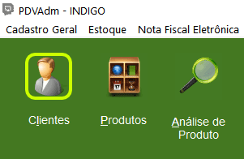
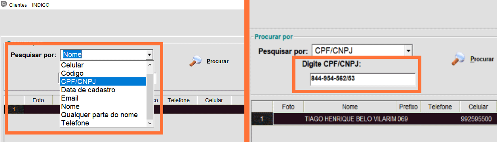
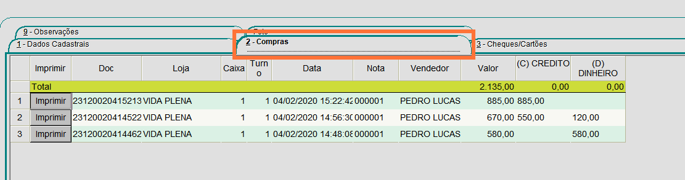
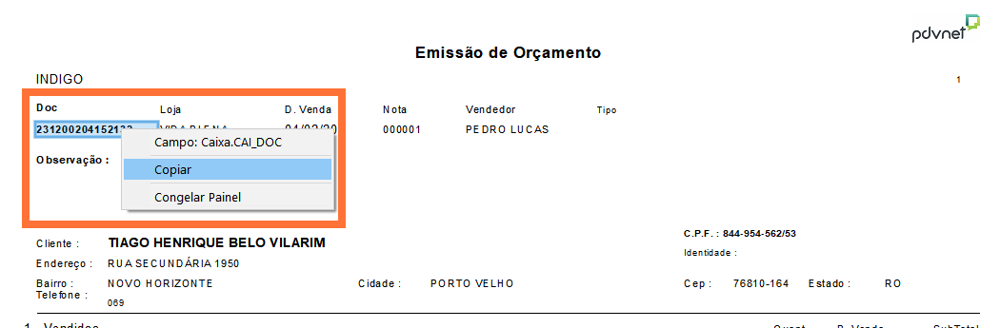

1.Clique em **PDVAdmin**:

  

2.Clique no botão **Clientes**:

  

3.Pesquise por Nome ou CPF, digite a informação, e clique em **Procurar** ou tecle **Enter**:

  

4.Clique na guia Compra, em seguida, clique em **Imprimir**:

  
  {: .img04}
  >
  >**Observação**
  >
  >**Cada venda possui um DOC especifico**, portanto, nos casos em que o cliente fez mais de uma compra certifique-se de estar clicando na desejada.

5.Por fim selecione o número do DOC e clique o botão direito do mouse selecionando a opção **Copiar**:

  
  {: .img04}
  >
  >**Observação**
  >
  >É fundamental que no momento que for copiar o DOC utilize o botão direito do mouse, uma vez que o sistema não identifica o atalho Ctrl+V.
