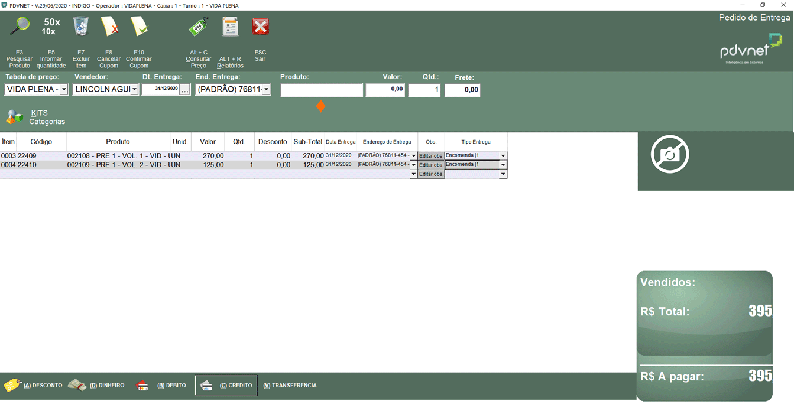
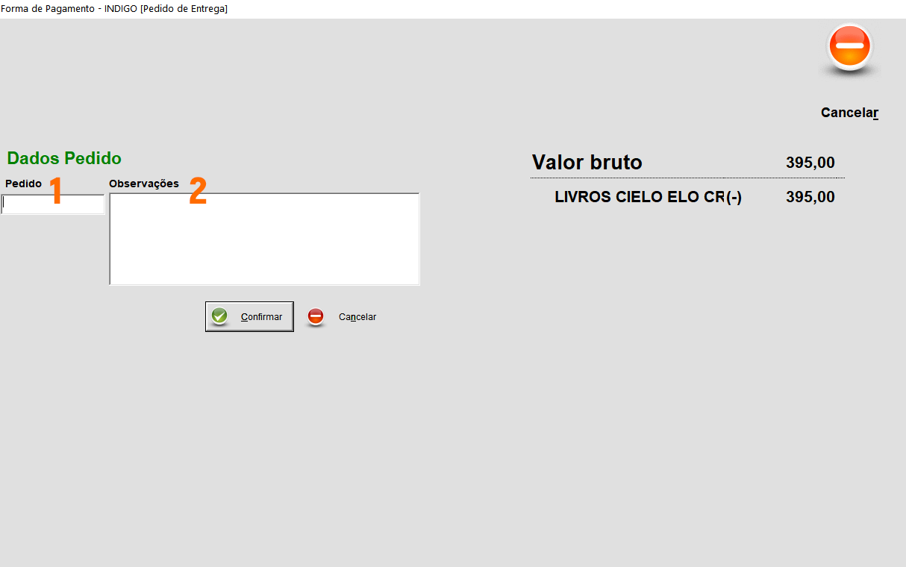

1.Clique em **PDVECF**:

  

2.Clique em **"2-ECF"** e em seguida clique **"2 - Pedido de Entrega"** - *(Atalho: Ctrl + D)*

  

3.Digite o CPF do cliente e tecle **Enter**

  

4.Preencha os campos assinalados com **♦** e após a revisão e confirmação dos dados, clique em **Confirmar**

  
  {: .img04}
  >
  >**Observações**
  >
  >1- Ao inserir o CEP, tecle **Enter**. O sistema buscará e exibirá o endereço. Confirme e siga com o cadastro. **O CEP é obrigatório.**
  >
  >2- **E-mail é totalmente obrigatório.** Motivo: A nota fiscal da venda será encaminhada para o email do cliente. Se o cliente não tiver e-mail, peça de alguém que ele tenha próximo (esposo(a), filho(a)). Se ainda assim não tiver, então você digita assim **matriculasememail@gmail.com**.

5.Digite o CPF do cliente na tela que irá abrir e tecle **Enter**. Na tela de *"Pedido de Entrega"* que se abriu, escolha a **"Tabela de preço"** *(dinheiro ou cartão)*, para que o sistema possa puxar o preço certo, quando você chegar no momento de digitar o código do produto. Após selecionar, não se esqueça, tecle **Enter**.

  

6.Preencha os campos: **(1)Vendedor (seu nome)**, **(2)Dt. Entrega (Sempre 31/12/ano vigente)**, **(3)End. Entrega (Sempre Padrão)** e **(4)Produto (Código do produto)**. A cada campo preenchido, tecle **Enter**.

  
  {: .img04}
  >
  >**Observações**
  >
  >Se não tiver a opção **“Padrão”** no momento de colocar o **End. Entrega**, é porque o cliente não está com endereço cadastrado. É necessário corrigir isso antes de prosseguir. Para evitar estes problemas, preencha corretamente o formulário de cadastro do cliente, como explicado no tópico 4.

7.Insira o código do produto que o cliente está comprando. Após isso tecle **Enter** por 3 vezes consecutivas para confirmar a escolha do produto.

  
  {: .img04}
  >
  >**Observações**
  >
  >1 - O código do produto pode ser referente a um kit ou um item específico *(seu supervisor lhe explicará)*.
  >
  >2 - Você terá um arquivo *(digital e impresso)* com os códigos dos itens usados na sua unidade.
  >
  >3 – Em caso de ter de inserir vários produtos, só insira o código do próximo produto, se você vir que o preço do produto anterior já está aparecendo corretamente na tela de total (tela verde).
  >
  >4 – Em **“Tipo Entrega”** é primordial que seja preenchido corretamente, de acordo com a disponibilidade do produto no ato da compra. Leia atentamente as informações da seção extra abaixo:

  >**Seção Extra - Entendendo Melhor “Tipo Entrega”**
  >
  >"Tipo Entrega" tem 3 opções disponíveis, mas nós só usamos duas: encomenda ou abate estoque loja.
  >
  >O que significam?
  >
  >    Encomenda: Um material (exemplo: livro) que o cliente está comprando e não temos no momento para entregar. Ou seja, ele está encomendando.
  >
  >    Abate Estoque: Um material (exemplo: livro) que o cliente está comprando e está levando no ato da compra. Ou seja, é um material que não foi encomendando. A retirada foi imediata.
  >
  >Preencher cada item com o campo “Tipo Entrega” corretamente faz toda diferença para o controle de estoque não ter erro e consequentemente não gerar prejuízos financeiros para a empresa. Em vendas de livros didáticos/paradidáticos é muito comum um cliente comprar diversos itens.
  >
  >*Vamos a um exemplo prático:*
  >
  >*Um cliente chega no estande e deseja comprar os seguintes livros: matemática, história, geografia, português, inglês, espanhol, física 1, física 2, química 2 e biologia. Ou seja, ele está comprando 10 livros.*
  >*Sendo que no momento que ele está comprando, no estande não tem os livros de história, física 1 e química 2. Como deveria ficar o status de cada item? Vejamos a tabela a seguir.*
  >
  >|  Produtos  |   Tipo Entrega   |
|:----------:|:----------------:|
| Matemática | Abate Estoque \| |
|  História  |   Encomenda \|1  |
|  Geografia | Abate Estoque \| |
|  Português | Abate Estoque \| |
|   Inglês   | Abate Estoque \| |
|  Espanhol  | Abate Estoque \| |
|  Física 1  |   Encomenda \|1  |
|  Física 2  | Abate Estoque \| |
|  Química 2 |   Encomenda \|1  |
|  Biologia  | Abate Estoque \| |
  {: .extra}

8.Após inserido(s) o(s) produto(s), defina a **forma de pagamento**.

  
  {: .img04}
  >
  >**Observações**
  >
  >O cliente pode querer pagar em mais de uma forma de pagamento. Não tem problema. **Antes de clicar, pergunte ao seu cliente.** Supondo que ele diga vai dar R$ 100,00 em dinheiro, R$ 100,00 no débito e o restante no crédito, não importa então em quem você clicará primeiro (dinheiro, débito ou crédito). **Você será instruído por seu supervisor sobre como fazer isso.**

9.Preencha os dados de pagamento.

  
  {: .img04}
  >
  >**Observações**
  >
  >**Só clique em confirmar, após receber do cliente.** Ou seja, se o pagamento for em cartão, peça a ele o cartão e passe na máquina. Se for em dinheiro, receba o mesmo, confira e então faça logo o recibo do cliente e também dê o troco (caso haja troco para dar). A partir daí, tendo recebido todo o valor é só seguir através do botão confirmar.

  >**Seção Extra - Entendendo Melhor as nomenclaturas para inserir a “Bandeira” certa**
  >
  >Para explicar esta parte, vamos usar como exemplo a nomenclatura selecionada (conforme a imagem acima): LIVROS CIELO ELO CREDITO.
  >
  >A Índigo tem dois CNPJ’s, ou seja, duas razões sociais diferentes. Sendo assim, há dois tipos de contas bancárias, para onde vão os pagamentos realizados via cartão. Dentro desta dinâmica desenvolvemos as nomenclaturas LIVROS e UNPAP.
  >
  >Toda e qualquer venda de livros, que o recebimento for em cartão, o vendedor tem que obrigatoriamente usar uma das opções que inicie com a palavra LIVROS.
  >
  >Toda e qualquer venda de uniforme ou papelaria, que o recebimento for em cartão, o vendedor tem que obrigatoriamente usar uma das opções que inicie com o acrônimo UNPAP.
  >
  >Nem toda escola que trabalhamos tem esses dois produtos (ou um deles), além de livros. Mas as que tem, certamente tem uma máquina para cada ação e cada uma destas é identificada seguindo as nomenclaturas.
  >
  >Se tratando da parte CIELO ou GN, significa qual a operadora. GN significa GetNet. Atualmente a prioridade é sempre usar as máquinas da CIELO, pois ali temos melhores margens de ganho do que na getNet. Contudo se a máquina CIELO apresentar problemas, use a GN.
  >
  >Seguindo, vem a bandeira do cartão (elo, master, visa, amex) e então o tipo de pagamento (credito ou débito). Quanto ao número entre parênteses, no nosso exemplo é o 38, ignore. Ele é só uma indicação de ordem de cadastro no sistema. Ele não faz diferença para você.
  {: .extra}

10.Vincule o aluno na venda que está acontecendo.

  
  {: .img04}
  >
  >**Observações**
  >
  >1 – Em relação a turma: Clique na seta, clique na série correta do aluno e tecle ENTER.
  >
  >2 – Em relação a aluno: Clique na seta, clique na opção “[Adicionar novo...]”. Tecle ENTER. Ele irá abrir a seguite tela:
  >
  >
  >
  >♦ - Coloque o nome completo e a série do aluno e tecle **Enter**.
  >
  >Em seguida clique em **Confirmar**.

11.Insira dados do pedido.

  
  {: .img04}
  >
  >**Observações**
  >
  >1 – O campo “Pedido” não precisa ser preenchido.
  >
  >2 – Em caso de ser venda de didático ou paradidático, o campo *“Observações”* deve ser preenchido com o nome do aluno novamente. Em caso de vendas de kit de sistema de ensino, não se faz necessário.

12.No campo “Nota”, sempre coloque o nº 1. Tecle **Enter** duas vezes após isso e aguarde.

  
  {: .img04}

13.Ao ver esta tela, é por que a venda foi concluída com sucesso. **Clique em Ok** e em seguida no botão **"Imprimir"**. Esta é a primeira folha (pedido de entrega) que vem antes do nosso contrato padrão. Serão as 3 folhas seguintes.

  
  {: .img04}
  >
  >**Observações**
  >
  >1 – Em vendas de didático e paradidático é ideal que esta folha seja impressa com o contrato. Apenas para este tipo de vendas.
  >
  >2 – Em caso de ser venda de kit de sistema de ensino, esta folha deve ser ignorada. Ou seja, só imprima as folhas 2, 3 e 4 conforme mostra a imagem abaixo:
  >
  >
  >
  >1 – Em intervalo de páginas, marque a opção “Páginas”
  >
  >2 – No retângulo coloque 2-4.
