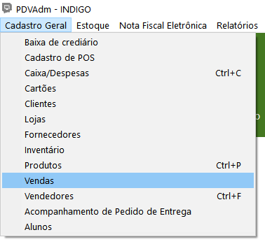
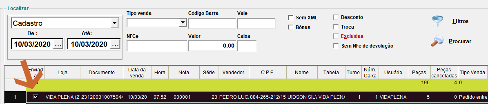
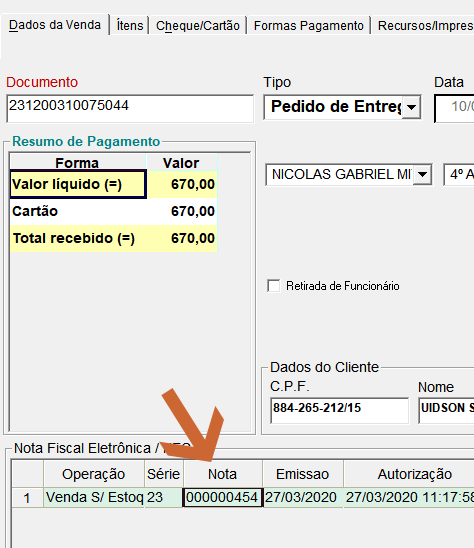
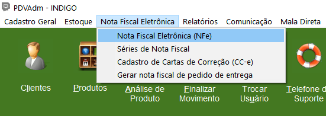
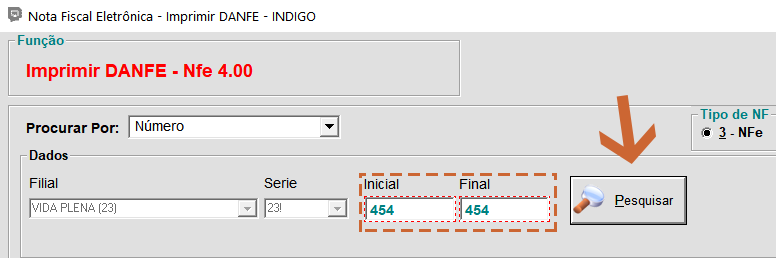
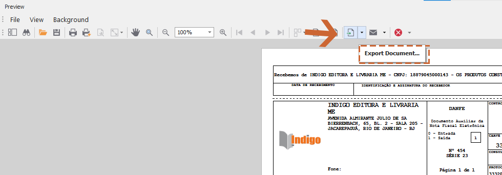
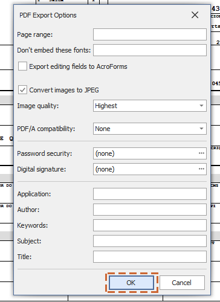
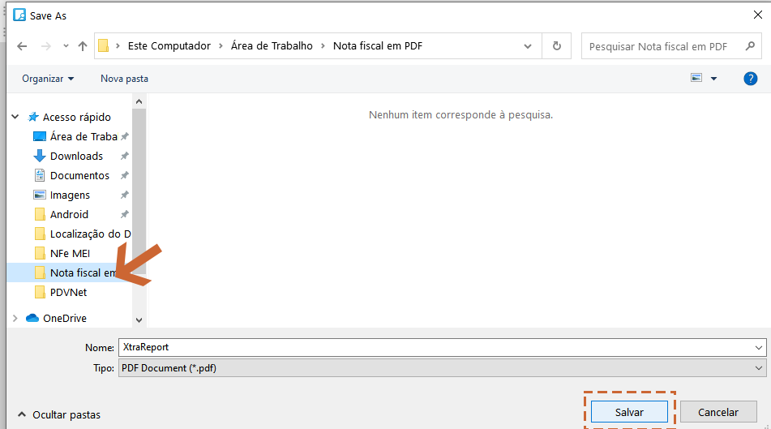

1.Acesse o Módulo PDVAdmin:

 

2.Clique em "Cadastro Geral", em seguida, "Vendas":

3.Selecione a venda que deseja exportar o PDF na Nota Fiscal:

4.Ao entrar na venda anote o número da Nota Fiscal:

 

5.Retorne ao PDVAdmin e clique na opção "Nota Fiscal Eletrônica", em seguida, "Nota Fiscal Eletrônica (NFe)":

 

 6.Preencha os campos indicados com o número de Nota Fiscal e depois clique em "Pesquisar":

 

 7.Ao entrar na Nota Fiscal selecione a opção "Export Document...":

 

 8.Nessa janela que abrirá, clique em "OK":

  

9.Selecione onde irá salvar a Nota Fiscal, defina o nome que desejar e salve em formato PDF:

  
