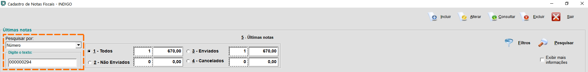

Quando uma NFE é feita, a mesma não é impressa, e sim enviada para o e-mail do cliente.

Contudo, há casos onde o cliente volta ao estande de atendimento para solicitar uma segunda via da NFE, ou a NFE impressa.
Nestes casos o atendente deverá pesquisar a NFE no sistema para localizá-la e então imprimir.

O processo é simples, mas é preciso atenção.

    * Com o CPF do cliente localize seu registro.
    * No registro do cliente, localize a compra dele.
    * No registro da vendas, localize a venda do cliente. Acesse a venda com dois cliques.
    * Dentro da venda do cliente, você localiza o nº da nota fiscal. (Por este número é possível localizar a NFE para a impressão.)

### Passo a passo de como usar o número da NFE para sua localização e impressão:

1.Dentro da venda do cliente, localize o número da nota.

  

2.No módulo PDVECF, vá no menu **“5-NFE”**, em seguida, **"2-Cadastro de Nota"**

  

3.Troque o critério de pesquisa para a opção **“Número”**.

  

4.Pesquise a nota pelo número dela.

  

5.Nota localizada, agora clique no ícone da impressora.

  

6.Agora é só imprimir.

  

Lembrando se desejar, ao invés de imprimir você pode salvar em PDF e enviar por e-mail ou outro meio de comunicação.
