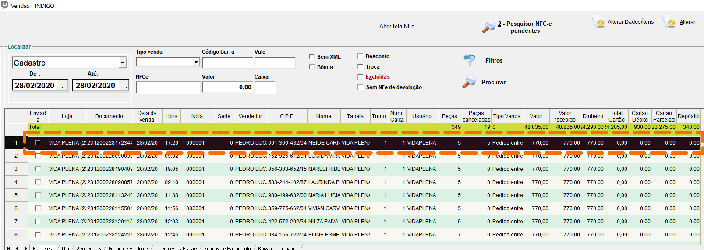
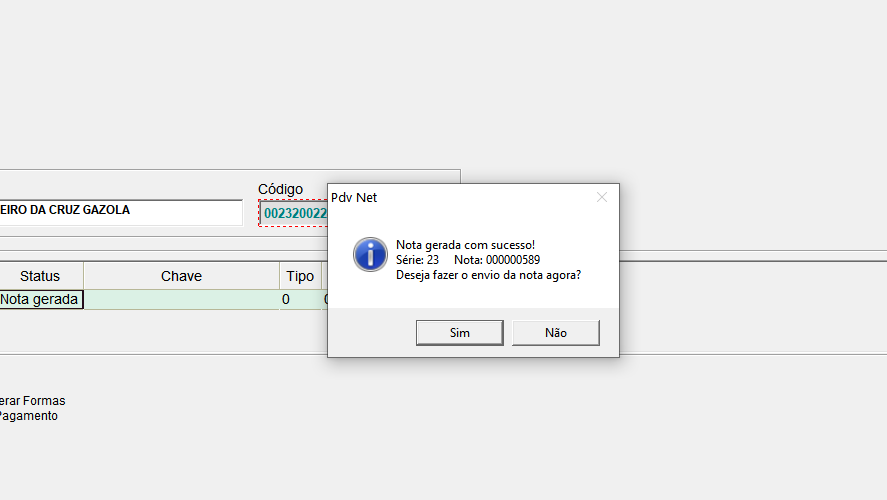
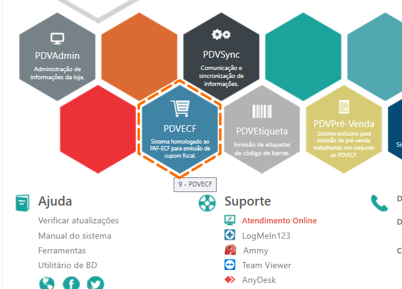
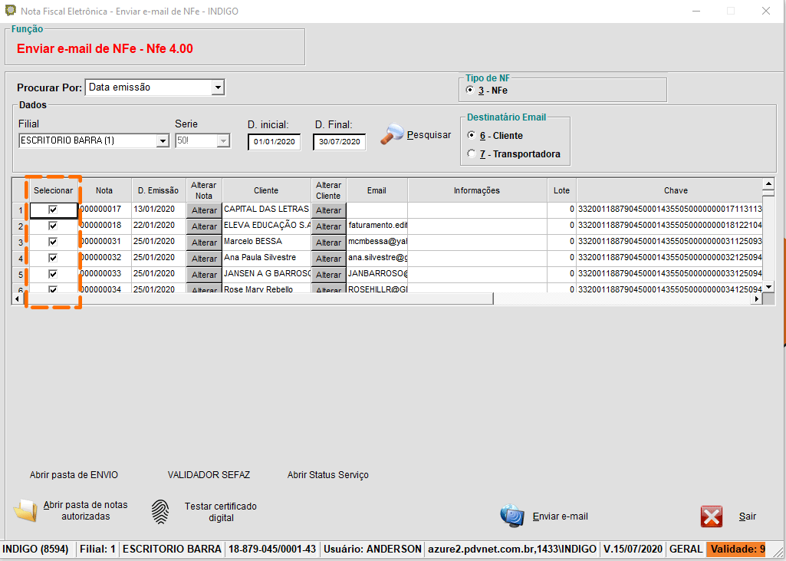

Quando uma venda é feita, é gerado uma nota fiscal e enviada para o e-mail do cliente cadastrado. Daí a importância de todo cliente ter um e-mail válido para sua usabilidade.
O processo de gerar uma nota fiscal é bem simples. Contudo, apesar de sua simplicidade, é uma das coisas mais importantes a ser feita e não deve ser negligenciado.

A nota fiscal sempre deve ser feita no máximo **até o último dia do mês em que aconteceu a venda**.
Ou seja, a venda foi feita em 05 de abril de 2020. A nota fiscal dessa venda deverá ser feita até 30 de abril de 2020.

Devido ao alto volume de vendas, o processo correto, obrigatório e padrão é lançar a nota fiscal no mesmo dia que fez a venda.

O ideal é que ao concluir a venda, antes mesmo de liberar o cliente ou atender o próximo, você faça o envio da nota fiscal. O processo é simples e rápido!

**O acumulo de notas fiscais pode gerar sérios problemas, pois se alguma nota não for lançada, a empresa é penalizada financeiramente, tendo de pagar multas para a receita federal. Portanto, mantenha suas notas fiscais em dia!**

É importante frisar que não é possível lançar uma nota fiscal sobre uma venda retroativa. Se a mesma não foi lançada dentro do mês, não há o que ser feito.

### Entendendo o processo para gerar NFE

Quando clicamos no botão gerar NFE *(vide passo a passo)*, existem dois envios a serem feitos.
O primeiro envio é para a Secretaria de Fazenda (SEFAZ). Ou seja, quando você diz que quer enviar a nota fiscal, você está mandando os dados da venda para o sistema da SEFAZ para que eles validem.
Assim que validar, eles autorizam a emissão da nota.
Este processo dura questão de segundos, e obrigatoriamente deve ter conexão com a internet.

Completo então o primeiro envio, agora é hora de fazer o segundo e último envio. Este significa que você estará enviando a NFE gerada para o e-mail do cliente.

Vale aqui a seguinte observação: enviar a nota para a SEFAZ é um processo individual de cada venda. Ou seja, tem que entrar na venda e fazer o envio da mesma. Uma por uma. Agora fazer o envio da NFE gerada para o e-mail do cliente, é um processo que pode ser feito em um grupo de clientes de uma vez só.

*Resumindo, enviar a NFE para o SEFAZ é individual. Enviar as NFE's para os clientes pode ser de uma vez ao fim do expediente.*

### Passo-a-passo Gerar NFE

1.Acesse o PDVAdmin

  

2.Vá em "Cadastro Geral" e em seguida em "Vendas"

  

3.Determine a data da venda e em seguida clique em **"Procurar"**

  

4.Dê dois cliques na venda na qual deseja enviar a NFE.

  

5.Na janela que se abre, clique no botão **"Gerar NFE"**

  

6.Na janela que se abriu, clique em **"Sim"**. Pronto! NFE enviada para o SEFAZ.

  

É importante que depois você faça o envio conjunto das notas para os clientes. O processo é simples:

1.Acesse o PDVECF.

  

2.Vá em *"5-NFE"*, e em seguida clique em *"Enviar Email de NFE para cliente"*

  

3.Em *Procurar por"*, selecione *"Data de Emissão"*. Preencha os campos, em seguida clique em **"Pesquisar"**

  

4.Verifique se as caixas de seleção estão marcadas e em seguida clique em **"Enviar e-mail"**

  
