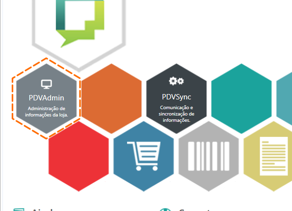
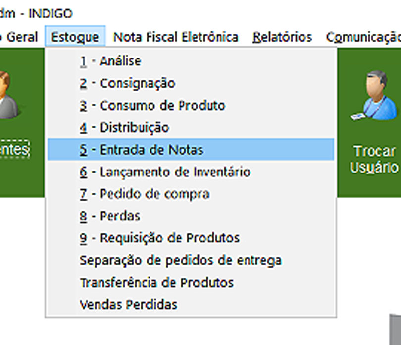
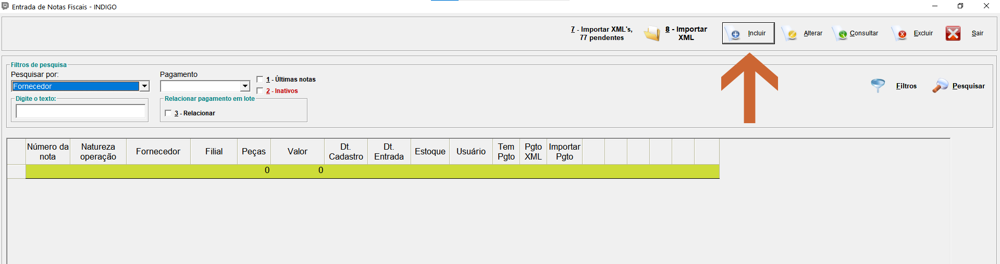
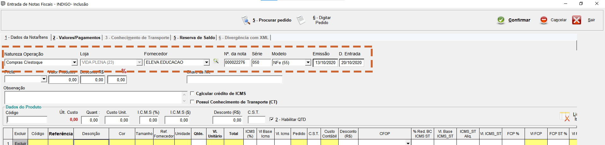
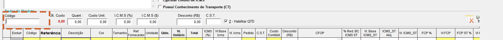
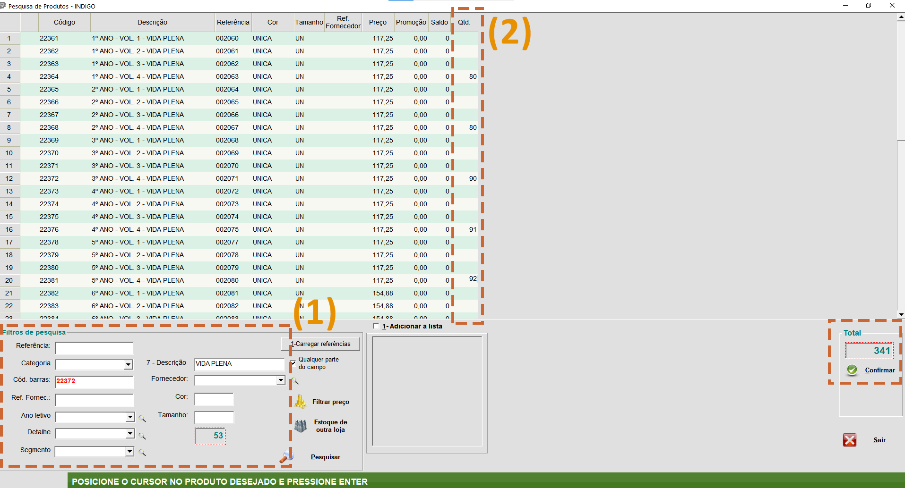
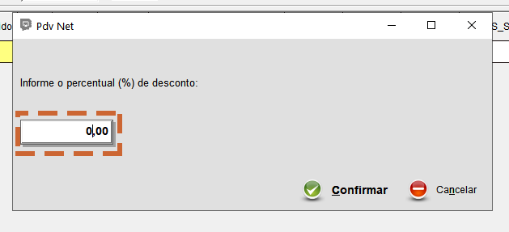
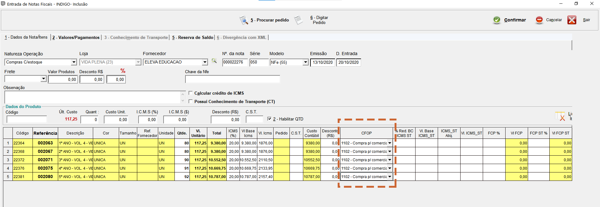
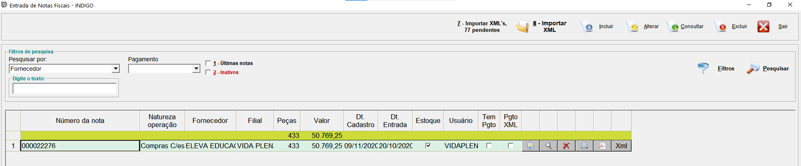

Quando a Eleva entregar os livros na escola, o vendedor já sabe que precisa assinar a nota fiscal e tem até 72 horas para conferir o material que chegou.

Após isso ele deverá lançar no sistema a nota fiscal.
>
>**Observação**
>
>Não precisará lançar os dados de Livro do Professor (LP), simulados e avaliações. Lance MD, LIV, Artes, TEC, Espanhol, Inglês ...

1.Acesse o Módulo PDVAdmin:

2.Clique em "Estoque", em seguida, "Entrada de Notas":

3.Clique em "Incluir":

4.Preencha os campos necessários:

{: .img04}
>
>* **Natureza Operação:**Compras C/ Estoque
>* **Fornecedor:**Eleva Educação
>* **Nª da Nota:**Veja o número da nota fiscal que você receber.
>* **Série:**Veja o número de série na Nota.
>* **Modelo:**NFe.
>* **Emissão:**Veja a data de emissão que consta na nota.
>* **D. Entrada:**Dia que você recebeu o material na escola.

5.Clique dentro da caixa "Código", e tecle F3:

6.Pesquise os produtos da sua escola(1). Após isso adicione a quantidade dos produtos(2) que chegaram, de acordo com a referentes nota fiscal. Em seguida clique em "Confirmar":

7.Após clicar em "Confirmar", você será levado à esta tela, onde deixará em 0,00. Em seguida, clique em "Confirmar" até que ela pare de aparecer:

8.Insira o CFOP de cada produto. Ao terminar, clique em "Confirmar":

{: .img04}
>
>**Observação**
>
>* Se você for do RJ, o CFOP é 1102.
>
>* Se você for de fora do RJ, o CFOP é 2102.
> CFOP significa Código Fiscal de Operações e Prestações.

9.Pronto, sua nota fiscal foi lançada.

