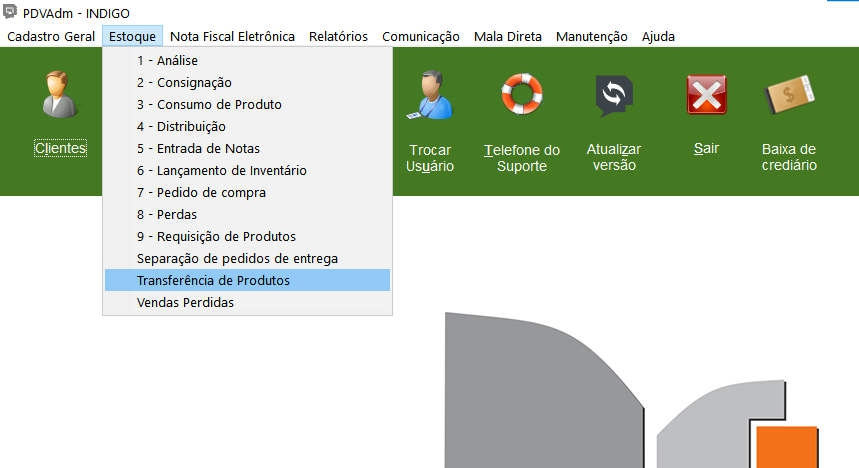
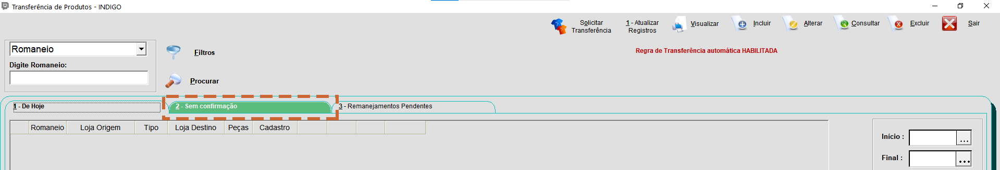
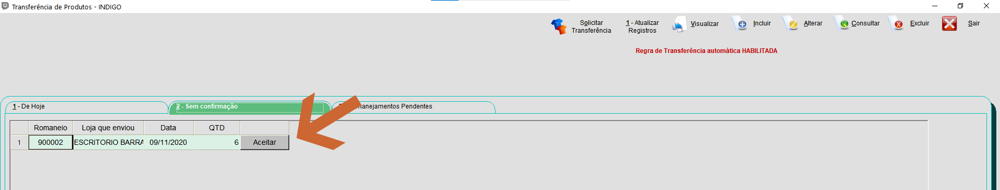
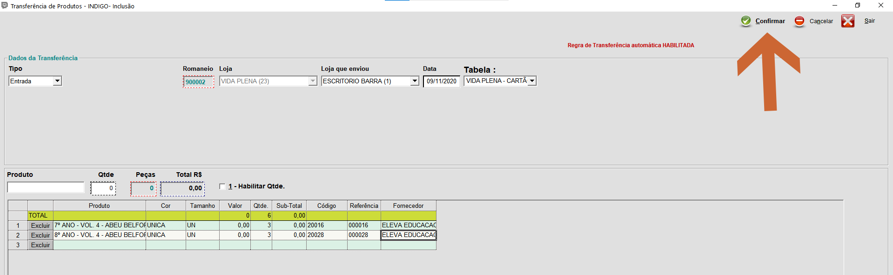
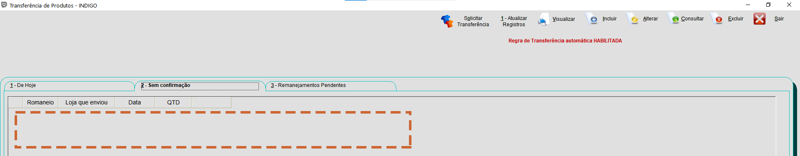

Quando algum livro chegar na sua escola, vindo de uma outra escola ou do escritório, será necessário aceitar esta transferência de produto em seu sistema.

**Recebendo Transferência:**

1.Acesse o Módulo **PDVAdmin**:

2.Clique em **"Estoque"**, em seguida, **"Transferência de Produtos"**:

3.Vá até a guia **"Sem Confirmação"**:

{: .img04}
>
>**Observação:**
>
>Quando há alguma transferência de produtos para ser aceita, a guia “Sem Confirmação” fica sinalizada pela cor verde. Repare.

4.Você verá a transferência que fizeram para sua loja. Clique em **"Aceitar"**:

5.Verifiquei se está tudo certo, e clique em **"Confirmar"**:

6.Na tela de transferência não haverá mais nada para ser aceito.

>
>**Observação**
>
>Se quando você for aceitar os produtos, você ver que tem algo errado, faça a devida correção e confirme. **Notifique seu supervisor sobre o erro**, pois ele terá de fazer o batimento.
