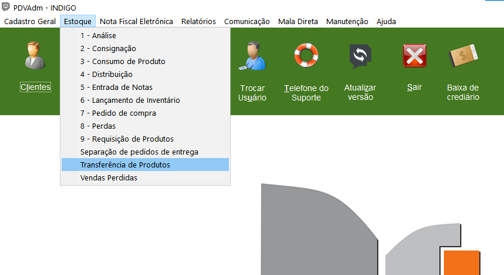
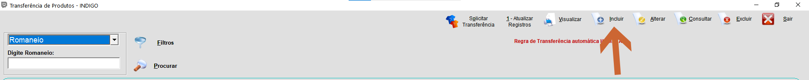
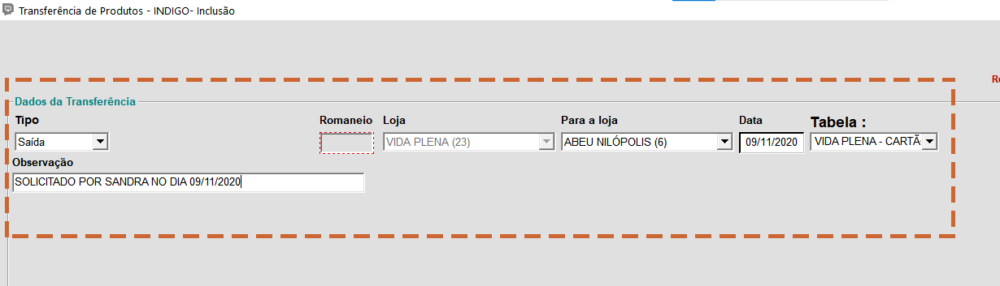
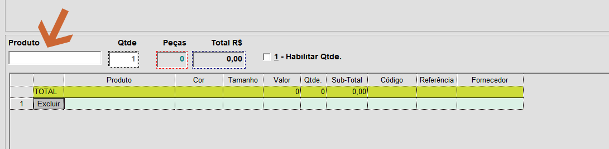
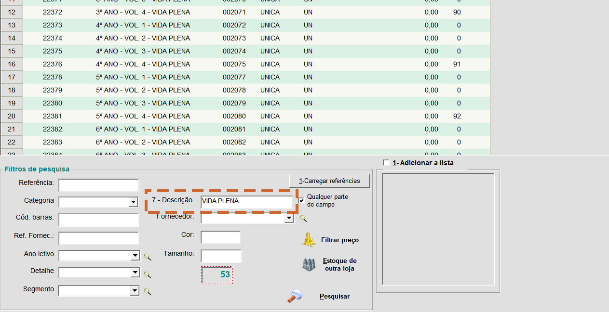
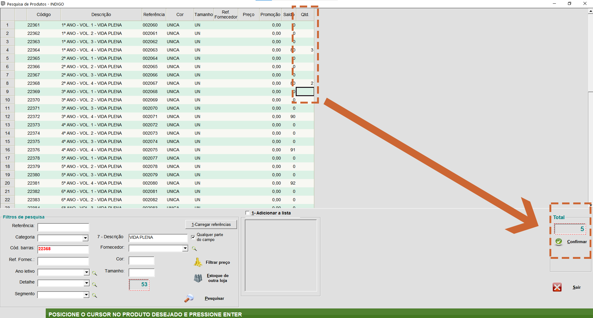
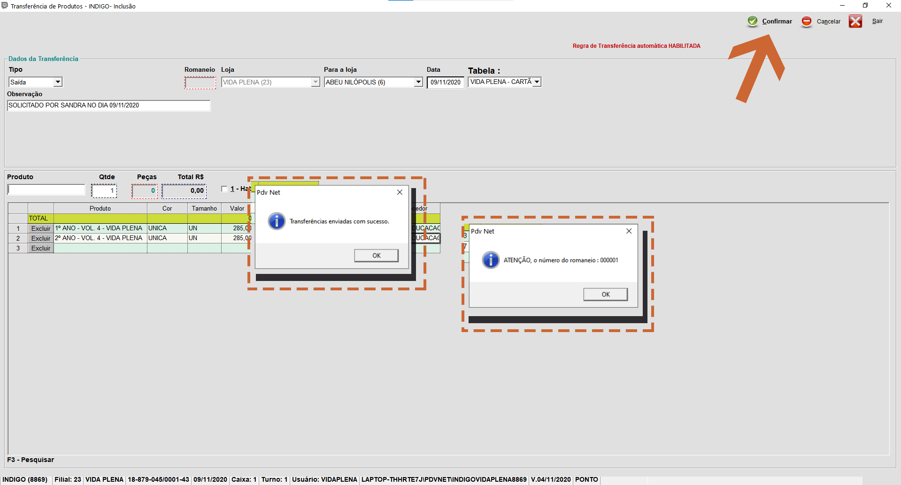
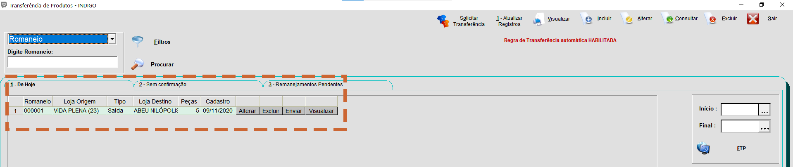

Quando for necessário sair algum livro da sua unidade escolar para algum lugar, seja uma outra escola ou o escritório, será necessário gerar uma transferência de produtos.

**Realizando Transferência:**

1.Acesse o Módulo **PDVAdmin**:

2.Clique em **"Estoque"**, em seguida, **"Transferência de Produtos"**:

-Na janela que irá se abrir, clique em **"Incluir"**:

3.Defina o destino:

{: .img04}
>
>**Tipo:** Coloque "Saída".
>
>**Loja:** Você não terá como mexer, pois ficará preenchido automaticamente.
>
>**Para a Loja:** Coloque o destinatário.
>
>**Data:** Insira a data que a transferência será feita.
>
>**Tabela:** Não precisa se importar com isso. Pode ser qualquer coisa.
>
>**Observação:** É um campo **obrigatório**.
>Por padrão, vamos adotar o seguinte script: "SOLICITADO POR xxxxxxxx NO DIA xx/xx/xxxx"

4.Localize agora o material para poder inserir o que será transferido:

{: .img04}
>
>Clique dentro do retângulo referente ao campo **"Produto"**.
>Tecle F3, uma nova janela abrirá para efetuar a pesquisa do produto.
> 

-No campo **"Descrição"**, digite o nome da sua escola e tecle ENTER. Aparecerão todos os produtos cadastrados referentes a sua loja.

5.Insira a quantidade, na coluna **"Qtd."**, do que será transferido. Ao terminar clique em **"Confirmar"**:

6.Na tela de transferência, clique em **"Confirmar"**, e em **"OK"** na duas próximas janelas, para finalizar o processo.

7.Sua transferência foi concluída.

